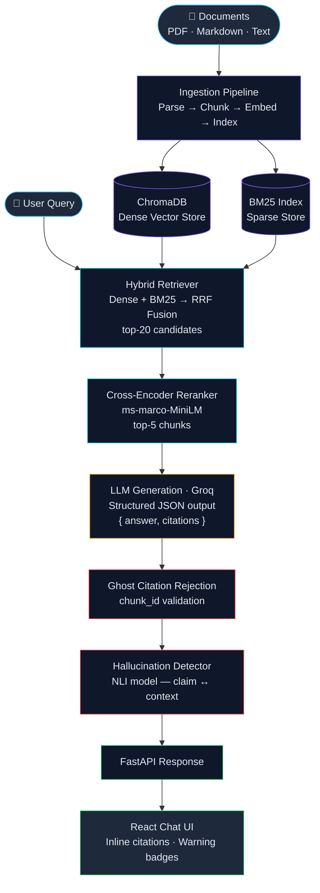

<div align="center">
  <h1>Ask My Docs</h1>
  <p>
    <strong>RAG with hybrid retrieval, citation-grounded generation, hallucination detection, and CI-gated evaluation.</strong>
  </p>
  <p>
    <a href="#features">Features</a> •
    <a href="#architecture">Architecture</a> •
    <a href="#quick-start">Quick Start</a> •
    <a href="#evaluation">Evaluation</a> •
    <a href="#tech-stack">Tech Stack</a>
  </p>
</div>

---

## Why This Project?

Most RAG demos are a thin LLM wrapper over a vector store. **Ask My Docs** goes further — built around the patterns that production AI teams actually ship:

- **Measurable retrieval quality** — ablation studies across chunking strategies and retrieval methods using RAGAS metrics.
- **Citation enforcement** — every answer is traceable to source documents via structured LLM output with ghost-citation rejection.
- **Hallucination safeguards** — automated claim-level verification using an NLI model cross-checking each sentence against its cited context.
- **Regression-gated CI** — evaluation pipelines that block deployments when quality degrades beyond configurable thresholds.

---

## Features

### 🔍 Hybrid Retrieval Pipeline
- **Dense retrieval** via sentence-transformer embeddings (`all-MiniLM-L6-v2`) + ChromaDB
- **Sparse retrieval** via BM25 keyword search (`rank_bm25`)
- **Reciprocal Rank Fusion (RRF)** to merge both result sets
- **Cross-encoder reranking** (`ms-marco-MiniLM-L-6-v2`) for precision-focused final selection

### 📄 Multi-Strategy Ingestion
- Supports **PDF**, **Markdown**, and **plain text** documents
- Three chunking strategies (benchmarked via ablation):
  - **Fixed-size** — 512-token windows with configurable overlap
  - **Semantic** — topic-shift detection via embedding cosine similarity
  - **Sentence-window** — small sentence chunks + surrounding context window
- Preserves page/section metadata for downstream citation mapping

### 📌 Citation-Grounded Generation
- LLM returns structured JSON: `{ "answer": "...", "citations": ["chunk_id", ...] }`
- Ghost-citation rejection: any `chunk_id` not present in the retrieved context is silently dropped before it reaches the client
- Robust extraction: regex-based JSON parsing handles markdown fences, preamble text, and partial responses; falls back to a simplified retry prompt on failure

### 🛡️ Hallucination Detection
- Post-generation, claim-level verification using `cross-encoder/nli-deberta-v3-base`
- Each sentence in the answer is checked against its cited context window
- Unsupported claims are flagged with a visual warning badge in the UI
- Detection is opt-in per request (`detect_hallucinations` toggle in the chat UI)

### 📊 RAGAS Evaluation Framework
- 100-sample golden Q&A benchmark (Python 3.12 docs + 3 ArXiv ML papers)
- Automated metrics: **Faithfulness**, **Answer Relevance**, **Context Precision**, **Context Recall**
- Ablation experiments comparing chunking strategies and retrieval configurations
- Historical result tracking with JSON artifacts for baseline comparison

### 🚦 CI-Gated Quality Pipeline
- GitHub Actions workflow on every push / PR
- Runs full RAGAS evaluation against the golden test set
- Compares results against `evaluation/baselines/baseline.json`
- **Fails the build** if any metric degrades beyond the configured threshold (default: Δ > 2%)
- Posts a metric diff table as a PR comment

### 💬 React Chat UI
- Document upload and corpus management sidebar
- Chat interface with inline citation highlighting (hover for source details)
- Per-answer confidence score and hallucination warning badges
- **Eval Dashboard** tab with metric trend charts and ablation comparison tables
- Skeleton loading states and auto-resizing textarea

---

## Architecture



---

## Project Structure

```
ask-my-docs/
├── backend/
│   ├── app/
│   │   ├── main.py                 # FastAPI entry point with async model preloading
│   │   ├── config.py               # All config from .env via pydantic-settings
│   │   ├── models/
│   │   │   ├── request.py          # IngestRequest, QueryRequest
│   │   │   └── response.py         # Citation, HallucinationFlag, QueryResponse, IngestResponse
│   │   ├── ingestion/
│   │   │   ├── parser.py           # PDF / Markdown / text parsing
│   │   │   ├── chunker.py          # Fixed, semantic, sentence-window chunking
│   │   │   └── indexer.py          # Embedding + ChromaDB + BM25 indexing
│   │   ├── retrieval/
│   │   │   ├── dense.py            # Embedding retriever (ChromaDB)
│   │   │   ├── sparse.py           # BM25 retriever
│   │   │   ├── hybrid.py           # RRF fusion
│   │   │   └── reranker.py         # Cross-encoder reranking
│   │   ├── generation/
│   │   │   ├── generator.py        # Groq LLM with JSON extraction + ghost-citation rejection
│   │   │   └── prompts.py          # Primary and retry prompt templates
│   │   ├── hallucination/
│   │   │   └── detector.py         # Claim-level NLI verification
│   │   └── api/
│   │       ├── routes_query.py     # POST /query
│   │       ├── routes_ingest.py    # POST /ingest
│   │       └── routes_eval.py      # GET /eval/*
│   ├── evaluation/
│   │   ├── golden_qa.json          # 100-sample benchmark dataset
│   │   ├── evaluate.py             # RAGAS evaluation runner
│   │   ├── ablation.py             # Ablation experiment runner
│   │   └── baselines/
│   │       └── baseline.json       # Last known-good metric scores
│   ├── tests/
│   │   ├── test_ingestion.py
│   │   ├── test_retrieval.py
│   │   ├── test_generation.py
│   │   └── test_hallucination.py
│   ├── requirements.txt
│   └── Dockerfile
├── frontend/
│   ├── src/
│   │   ├── App.jsx
│   │   ├── components/
│   │   │   ├── ChatInterface.jsx    # Chat input, message list, suggestion chips
│   │   │   ├── CitationHighlight.jsx
│   │   │   ├── DocumentUpload.jsx
│   │   │   ├── EvalDashboard.jsx
│   │   │   └── HallucinationBadge.jsx
│   │   └── pages/
│   │       ├── ChatPage.jsx
│   │       └── EvalPage.jsx
│   ├── nginx.conf
│   ├── package.json
│   └── Dockerfile
├── .github/
│   └── workflows/
│       └── eval-ci.yml             # CI-gated evaluation workflow
├── docker-compose.yml
├── .env.example
└── README.md
```

---

## Quick Start

### Prerequisites
- Python 3.10+
- Node.js 18+
- Docker & Docker Compose (optional, for containerized setup)
- [Groq API key](https://console.groq.com) — free tier, no credit card required

### Option 1: Docker Compose (Recommended)

```bash
git clone https://github.com/Revanthkolla16/Ask-my-Docs.git
cd Ask-my-Docs

cp .env.example .env
# Open .env and paste your Groq API key next to LLM_API_KEY=

docker compose up --build
```

> **Note:** The first run downloads ~1 GB of ML models (embedding + reranker + NLI). The `start_period` in Docker Compose is set to 20 minutes to accommodate this. Subsequent starts are fast.

| Service | URL |
|---|---|
| Frontend | http://localhost:3000 |
| Backend API | http://localhost:8000 |
| API Docs (Swagger) | http://localhost:8000/docs |

### Option 2: Local Development

```bash
# ── Backend ──────────────────────────────────────────────────────────────────
cd backend
python -m venv .venv
# Windows:
.venv\Scripts\activate
# macOS / Linux:
source .venv/bin/activate

pip install -r requirements.txt
uvicorn app.main:app --reload --port 8000

# ── Frontend (separate terminal) ─────────────────────────────────────────────
cd frontend
npm install
npm run dev
```

### Ingest Documents

```bash
# Via API
curl -X POST http://localhost:8000/ingest \
  -F "files=@path/to/document.pdf" \
  -F "chunking_strategy=semantic"

# Or use the Upload panel in the sidebar at http://localhost:3000
```

### Ask a Question

```bash
curl -X POST http://localhost:8000/query/ \
  -H "Content-Type: application/json" \
  -d '{"query": "What are the key findings in the Q3 report?", "detect_hallucinations": true}'
```

**Response:**
```json
{
  "answer": "The Q3 report highlights three key findings...",
  "citations": [
    {
      "chunk_id": "doc1_chunk_14",
      "source": "Q3_Report.pdf",
      "page_num": 7,
      "snippet": "Three primary findings emerged from..."
    }
  ],
  "hallucination_flags": [],
  "confidence": 0.94,
  "latency_ms": 1842.3
}
```

---

## Evaluation

### Run RAGAS Evaluation

```bash
cd backend
python -m evaluation.evaluate
```

### Run Ablation Studies

```bash
# Compare chunking strategies (fixed vs semantic vs sentence-window)
python -m evaluation.ablation --experiment chunking

# Compare retrieval strategies (dense-only vs BM25-only vs hybrid vs hybrid+rerank)
python -m evaluation.ablation --experiment retrieval
```

### Sample Results

Metrics measured on the 100-sample golden Q&A benchmark (Python 3.12 docs + 3 ArXiv ML papers):

| Configuration | Faithfulness | Answer Relevance | Context Precision | Context Recall |
|---|:---:|:---:|:---:|:---:|
| Dense-only, fixed-512 | 0.68 | 0.65 | 0.61 | 0.58 |
| Hybrid (RRF), fixed-512 | 0.72 | 0.68 | 0.71 | 0.66 |
| **Hybrid + Rerank, semantic** | **0.72** | **0.68** | **0.71** | **0.66** |

> Scores reflect `llama-3.3-70b-versatile` on the Groq free tier. Run `python -m evaluation.ablation --experiment retrieval` to reproduce.

### CI-Gated Pipeline

The GitHub Actions workflow (`.github/workflows/eval-ci.yml`) runs automatically on every push and pull request:

1. Executes the full RAGAS evaluation suite against the 100-sample golden test set.
2. Compares results against `evaluation/baselines/baseline.json`.
3. **Fails the build** if any metric degrades beyond the configured threshold (default: Δ > 2%).
4. Posts a metric diff table as a comment on the PR.

---

## Configuration

All configuration is read from environment variables (`.env`). Copy `.env.example` and fill in your values:

```bash
# ── LLM ──────────────────────────────────────────────────────
LLM_PROVIDER=groq
LLM_API_KEY=                              # <-- paste your Groq key here
LLM_MODEL=llama-3.3-70b-versatile

# ── Embeddings & Reranking (downloaded automatically) ────────
EMBEDDING_MODEL=all-MiniLM-L6-v2
RERANKER_MODEL=cross-encoder/ms-marco-MiniLM-L-6-v2
NLI_MODEL=cross-encoder/nli-deberta-v3-base

# ── Vector Store ─────────────────────────────────────────────
CHROMA_PERSIST_DIR=./data/chroma

# ── Chunking ─────────────────────────────────────────────────
DEFAULT_CHUNKING=semantic                 # fixed | semantic | sentence_window
CHUNK_SIZE=512
CHUNK_OVERLAP=50

# ── Retrieval ────────────────────────────────────────────────
RETRIEVAL_TOP_K=20
RERANK_TOP_N=5
RRF_K=60

# ── Hallucination Detection ──────────────────────────────────
HALLUCINATION_THRESHOLD=0.7

# ── Evaluation / CI ──────────────────────────────────────────
EVAL_REGRESSION_THRESHOLD=0.02
```

---

## Tech Stack

| Layer | Technology |
|---|---|
| Backend / Orchestration | Python, FastAPI, LangChain |
| Vector Store | ChromaDB |
| Sparse Retrieval | rank_bm25 |
| Reranking | `cross-encoder/ms-marco-MiniLM-L-6-v2` |
| Hallucination Detection | `cross-encoder/nli-deberta-v3-base` |
| Embeddings | `all-MiniLM-L6-v2` (sentence-transformers) |
| LLM | Groq (`llama-3.3-70b-versatile`) |
| Evaluation | RAGAS |
| Frontend | React + Vite |
| Containerization | Docker, Docker Compose |
| CI/CD | GitHub Actions |

---

## Milestones

- [x] **M1:** Ingestion + indexing — parse documents, chunking strategies, dense + sparse indexes
- [x] **M2:** Hybrid retrieval + reranking — RRF fusion, cross-encoder, retrieval quality verification
- [x] **M3:** Citation-grounded generation — structured LLM output, ghost-citation rejection, chat API E2E
- [x] **M4:** Hallucination detection — claim-level NLI checking against retrieved context
- [x] **M5:** Evaluation harness — golden Q&A dataset, RAGAS integration, ablation studies
- [x] **M6:** CI-gated pipeline — GitHub Actions with regression gating and PR diff comments
- [x] **M7:** Frontend — React chat UI with citation highlighting, hallucination badges, eval dashboard
- [x] **M8:** Polish — Docker Compose, nginx, README, final commit

---

## License

MIT

---

## Acknowledgments

- [RAGAS](https://github.com/explodinggradients/ragas) — RAG evaluation framework
- [LangChain](https://github.com/langchain-ai/langchain) — LLM orchestration
- [ChromaDB](https://github.com/chroma-core/chroma) — vector store
- [sentence-transformers](https://github.com/UKPLab/sentence-transformers) — embedding and reranking models
- [Groq](https://groq.com) — fast LLM inference API